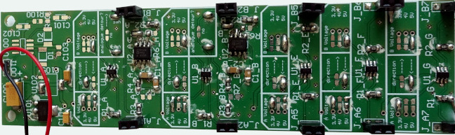
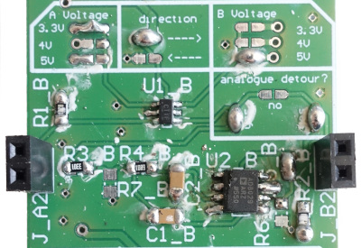
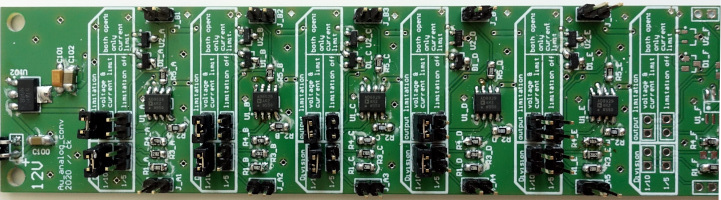
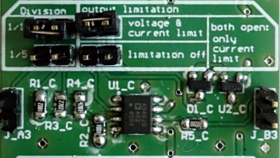

# Electronics

In order to use MicroFPGA with downstream devices, voltage conversion is sometimes necessary. Indeed, MicroFPGA present the following limitations:

- Output voltages are limited to 3.3 V.
- Digital inputs must be smaller than 3.3 V.
- No analog output signals natively.
- Analog input voltages are measured up to 1 V and must be smaller than 1.8 V (Au FPGA).

:warning: **If higher voltages are supplied, the FPGA can be irreversibly damaged.** :warning: 

Here, we provide two custom electronic boards to convert voltages to acceptable levels for the FPGA or downstream devices:

- [Signal conversion board](): multi-channel electronics allowing conversion of 3.3 V signals to 5 V, or inversely, with the option to low-pass the input signal in order to produce an analog signal output from a PWM (pulse-width modulation) input.
- [Analog conversion board](): multi-channel electronics converting 10 V or 5 V analog signals to 1 V, with the option to cap the maximum voltage to 1.6 V.

### Signal conversion board

#### Channels

The [signal conversion board](https://github.com/jdeschamps/MicroFPGA/tree/master/Electronics/Signal_conversion) is composed of 8 channels:

- 4 voltage conversion channels with optional low-pass filter.
- 4 bidirectional voltage conversion channels.

The channels only differ by the analog detour option. For the conversion channels without analog detour, or when the analog detour is ignored, the channels can be used in either direction: voltage A -> voltage B or B ->  A. **When the analog detour is soldered in, the voltage conversion is only performed A -> B**.

In order to choose the input and output voltages, refer to the channel header:

The channel header allows choosing the following parameters:

- **Voltage A**: 3.3 V, 4 V or 5 V. **A single voltage** must be chosen by soldering the two pads together.
- **Direction**: solder either "<---" or "--->" to choose the conversion direction between voltages A and B. **If you are using the analog detour, choose "--->".**
- **Voltage B**:  3.3 V, 4 V or 5 V. **A single voltage** must be chosen by soldering the two pads together.
- **Analog detour**: the analog detour is a low-pass RC filter that takes a **PWM** signal in input and output an **analog** signal. **In order to use the analog detour, select the "A --> B" direction.**

#### Power supply

The board is powered by a 5 V power supply. We typically use the same external power supply for the FPGA and the signal conversion board.

#### Folder content

The [signal conversion board folder](https://github.com/jdeschamps/MicroFPGA/tree/master/Electronics/Signal_conversion) contains the following subfolders:

- Altium project: complete project generated with Altium 17.1.9 (Build 592).
- BOM: bill of materials exported from the Altium project.
- Circuit: summary pdf containing an overview of the boards and the different circuits, generated from the Altium project.
- Gerber: gerber layers compatible with [gerbv](http://gerbv.sourceforge.net/), generated from the Altium project.
- NC drill: numeric control drill files corresponding to the PCB board, generated from the Altium project.

#### Use cases

- ##### Example 1: EMCCD camera with a 5 V laser trigger signal.

  In order to supply a 3.3 V camera trigger to the FPGA, one channel from the signal conversion board can be used. First, select the direction by soldering the "--->" or "<---" path. Then, solder in the arrow's input the 5 V level, and in the arrow's output the 3.3 V level. If the channel contains an analog detour option, solder the "no" path. 

- ##### Example 2: device with a 5V analog control signal.

  Using a PWM channel from the FPGA as input A to one channel, we can create an analog output between 0-5 V by setting the A voltage to 3.3 V, the "--->" direction, voltage B as 5 V and soldering both "yes" pads on the analog detour. While the PWM signal is a digital signal with pulses between 1 and 2 ms, the output analog signal will have a voltage directly dependent on the PWM pulse length.

### Analog conversion board

#### Channels

Since the Au FPGA analog input are limited to the 0-1 V range and are only safe up to 1.6 V, an additional circuit is necessary to convert commonly encountered 5 and 10 V inputs. The [analog conversion board](https://github.com/jdeschamps/MicroFPGA/tree/master/Electronics/Analog_conversion) is composed of 8 channels allowing 1/10 or 1/5 voltage conversion. Additionally, the voltage and current limit can be disabled.

Each channel header present options that need to be jumped:

- **Division**: 1/10 or 1/5. One of the two division level must be chosen. 
- **Output limitation**: 
  - Jumper on the **voltage and current limit**: the output voltage and current will be caped in order to prevent damages to the FPGA.
  - Jumper on the **limitation off**: the output voltages and current will not be caped. **This may endanger your FPGA.**
  - No jumper: only the output current is capped.

#### Power supply

The board is powered by a 12 V power supply. 

#### Folder content

The [analog conversion board](https://github.com/jdeschamps/MicroFPGA/tree/master/Electronics/Analog_conversion) contains the following subfolders:

- Altium project: complete project generated with Altium 17.1.9 (Build 592).
- BOM: bill of materials exported from the Altium project.
- Gerber: gerber layers compatible with [gerbv](http://gerbv.sourceforge.net/), generated from the Altium project.
- NC drill: numeric control drill files corresponding to the PCB board, generated from the Altium project.

#### Use case

If a sensor on the microscope has an analog output comprised between 0 and 10 V, feeding it directly to the Au FPGA will saturate the read-out channel. Therefore, the signal is set as input of the conversion board, with the 1/10 option selected as well as the "voltage and current limitation" one. The output of the channel is then safe to be wired to the FPGA and the will allow reading out the signal.

Both electronic boards were designed by Christian Kieser (Electronic workshop, EMBL).
